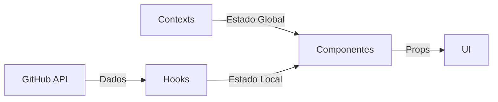

# Portfolio Pessoal

Portfolio moderno e responsivo desenvolvido com Next.js, TypeScript e Tailwind CSS, apresentando uma experiência de usuário imersiva com suporte a temas claro/escuro e internacionalização.

## Funcionalidades

- 🌓 Tema claro/escuro com transições suaves
- 🌐 Suporte a múltiplos idiomas (PT/EN)
- 📱 Design totalmente responsivo
- 🎨 Interface moderna com efeitos de glassmorphism
- ⚡ Performance otimizada com Next.js
- 🎯 Animações e transições fluidas
- 📊 Integração com GitHub para projetos
- 📬 Formulário de contato funcional
- 🔍 SEO otimizado
- 📱 PWA ready

## Estrutura do Projeto

```
src/
├── app/                    # Configuração do Next.js App Router
│   ├── layout.tsx         # Layout principal
│   └── page.tsx           # Página inicial
├── components/            # Componentes React
│   ├── ui/               # Componentes de UI reutilizáveis
│   ├── header.tsx        # Cabeçalho com navegação
│   ├── hero-section.tsx  # Seção hero
│   ├── about-section.tsx # Seção sobre
│   └── ...              # Outros componentes
├── contexts/             # Contextos React
│   ├── theme-context.tsx # Gerenciamento de tema
│   └── language-context.tsx # Gerenciamento de idiomas
├── hooks/               # Custom hooks
│   ├── use-projects.tsx # Hook para projetos GitHub
│   └── use-translation.tsx # Hook para traduções
├── lib/                 # Utilitários
│   └── utils.ts        # Funções utilitárias
├── public/             # Arquivos estáticos
│   ├── images/        # Imagens
│   └── fonts/         # Fontes
└── styles/            # Estilos globais
    └── globals.css    # Estilos CSS globais
```

## Arquitetura e Design

### Visão Geral da Arquitetura

O portfolio foi projetado seguindo princípios modernos de desenvolvimento web, com foco em performance, acessibilidade e experiência do usuário. A arquitetura é baseada em três pilares principais:

1. **Componentização**
   - Componentes reutilizáveis e modulares
   - Separação clara de responsabilidades
   - Props tipadas com TypeScript
   - Contextos para estado global

2. **Performance**
   - Renderização otimizada com Next.js
   - Lazy loading de componentes
   - Imagens otimizadas
   - Código dividido em chunks

3. **UX/UI**
   - Design responsivo
   - Animações suaves
   - Feedback visual imediato
   - Navegação intuitiva

### Fluxo de Dados



### Decisões de Design

1. **Tema Claro/Escuro**
   - Por que implementar tema?
     - Melhor experiência de leitura
     - Preferência do usuário
     - Redução de fadiga visual
     - Economia de bateria em dispositivos móveis
   - Implementação
     - Context API para gerenciamento
     - Persistência em localStorage
     - Transições suaves
     - Cores adaptativas

2. **Internacionalização**
   - Por que múltiplos idiomas?
     - Alcance global
     - Acessibilidade
     - Experiência personalizada
   - Implementação
     - Context API para idiomas
     - Arquivos de tradução JSON
     - Detecção automática de idioma
     - Persistência de preferência

3. **Responsividade**
   - Por que design responsivo?
     - Acesso em múltiplos dispositivos
     - Melhor experiência mobile
     - SEO otimizado
   - Implementação
     - Tailwind CSS para breakpoints
     - Imagens responsivas
     - Layouts adaptativos
     - Touch-friendly


## Tecnologias Utilizadas

<div align="center">
  
  
  
  
  
  
  
  
</div>

## Desenvolvedor

| Foto | Nome | Cargo |
|------|------|-------|
|  | [Jonatas Silva](https://github.com/JsCodeDevlopment) | FullStack Developer |

## Licença

Este projeto está sob a licença MIT. Veja o arquivo [LICENSE](LICENSE) para mais detalhes.

---

<div align="center">
  <sub>Built with ❤️ by <a href="https://github.com/JsCodeDevlopment">Jonatas Silva</a></sub>
</div> 